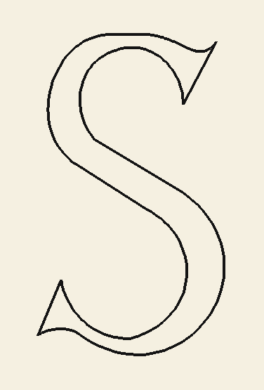

# The letter S

Python/PyGame implementation of drawing the letter “S” using Knuth’s METAFONT.



### Metafont code

```metafont
x1 = 4.5u; y1 = 9u;
x2 = 6u; y2 - 5.5u =
  sqrt((3.5u)(3.5u) - (x2 - 4.5u)(x2 - 4.5u));
draw 1{y1 - 5.5u, 4.5u - x1}..
  2{y2 - 5.5u, 4.5U - x2};
x3 = 6.5u; y3 = 8.5u;
x4 = 6u; y4=7u;
x5 = (6 + 16/17)u; y5 = (8 + 13/17)u;
draw 3{9u - y3, x3 - 6.5u}..
  5{9u - y5, x5 - 6.5u};
draw 4..5;
x6 = 4u; y6 = 9u;
x7 = 3u; 7u - y7 =
  sqrt((2u)(2u) - (x7 - 4u)(x7 - 4u));
draw 6{7u - y6, x6 - 4u}..7{7u - y7, x7 - 4u};
x8 = 5u; y8 = 4u; draw 7..8;
x9 = 3.5u; y9 = 6u;
x15 = 4.5u; y15 - 7.125u =
  sqrt((x9 - 4.5u)(x9 - 4.5u) +
  (y9 - 7.125u)(y9 - 7.125u));
draw 4{7.125u - y4, x4 - 4.5u}..15..
  9{7.125u - y9, x9 - 4.5u};
x10 = 6u; y10 = 4.5u; draw 9..10;
x11 = 3u; y11 = .5U;
draw 10{y10 - 2.5u, 4.5u - x10}..
  11{y11 - 2.5u, 4.5u - x11};
x16 = 2.5u; y11 - y16 =
  sqrt(u*u - (x11 - x16)(x11 - x16));
x12 = 1.875u; y12 - y16 =
  sqrt(u*u - (x12 - x16)(x12 - x16));
draw 11{y16 - yll, x11 - x16}..
  12{y16 - y12, x12 - x16};
x13 = 4.5u; x17 = 4u; y8 - y17 =
  sqrt((2u)(2u) - (x8 - x17)(x8 - x17));
y17 - y13 =
  sqrt((2u)(2u) - (x13 - x17)(x13 - x17));
draw 8{y8 - y17, x17 - x8}..
  13{y13 - y17, x17 - x13};
x18 = 4.5u; y18 - y13 =
  sqrt((2u)(2u) - (x18 - x13)(x18 - x13));
y14 = 2u; x18 - x14 =
  sqrt((2u)(2u) - (y18 - y14)(y18 - y14));
draw 13{y13 - y18, x18 - x13}..
  14{y14 - y18, x18 - x14};
draw 14..12.
```

### References

<https://gwern.net/doc/design/typography/1980-knuth.pdf>
